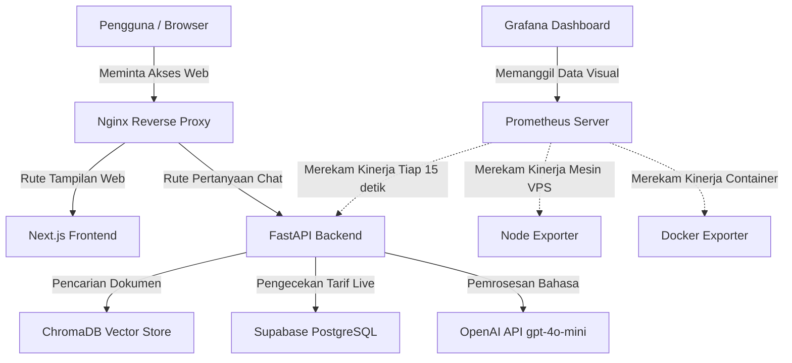

# Laporan Dokumentasi Teknis Sistem
**Analisis Kinerja Jaringan (QoS) pada Layanan RAG Chatbot Menggunakan Prometheus & Grafana**

Dokumen ini disusun sebagai laporan komprehensif yang menjabarkan arsitektur, mekanisme kerja, dan metodologi pemantauan sistem chatbot Anjem UGM. Penjelasan di dalam dokumen ini dirancang agar lugas, terstruktur, dan dapat diandalkan sebagai referensi utama proyek tugas akhir.

---

## BAB I: Tinjauan Umum Proyek

### 1.1 Deskripsi Proyek
Proyek ini bertujuan untuk membangun sebuah asisten virtual cerdas (Chatbot) bagi layanan Antar Jemput (Anjem) UGM. Alih-alih menggunakan AI biasa yang rentan memberikan informasi salah (*halusinasi*), chatbot ini dirancang khusus agar selalu menjawab berdasarkan dokumen SOP asli (FAQ) dan tarif nyata yang sedang berlaku.

### 1.2 Fokus Penelitian
Fokus utama penelitian ini **bukanlah** pada pembuatan mesin AI itu sendiri, melainkan pada **Infrastruktur Jaringan dan Kinerja Layanan (Quality of Service / QoS)**. Penelitian ini berfokus menjawab: *Bagaimana membangun arsitektur perutean (routing) antar komponen cerdas secara terisolasi (Microservices), dan bagaimana memastikan sistem ini tetap merespons dengan cepat dan akurat walau diakses banyak pengguna bersamaan.*

---

## BAB II: Arsitektur Sistem & Infrastruktur Server

Sistem dibangun di atas mesin *Virtual Private Server* (VPS) dan dikemas menggunakan **Docker** guna memastikan setiap komponen aplikasi terkurung secara aman (*Containerization*) dan tidak saling berebut sumber daya tanpa kendali.

### 2.1 Topologi Alur Jaringan

### 2.2 Penjelasan Komponen Arsitektur
1.  **Nginx (Reverse Proxy):** Bertindak sebagai "polisi lalu lintas" jaringan. Saat ada pengguna masuk, Nginx akan memandu akses tersebut; apakah diarahkan ke halaman antarmuka web (Frontend) ataukah diarahkan ke lorong mesin pemroses data (Backend).
2.  **Frontend (Next.js):** Antarmuka grafis yang dilihat langsung oleh pengunjung situs Anjem UGM.
3.  **Backend (FastAPI):** Bertindak sebagai "Pelayan Utama" (*Orchestrator*). Backend inilah yang berinteraksi dengan database dan mesin AI.

---

## BAB III: Mekanisme Retrieval-Augmented Generation (RAG)

Chatbot yang cerdas membutuhkan konteks. **RAG** adalah teknik di mana kita "menyogok" AI dengan dokumen contekan sesaat sebelum ia diberi pertanyaan oleh User, sehingga jawaban AI tidak mengarang bebas.

### 3.1 Empat Fase Cara Kerja RAG Chatbot
Kerja sistem AI pada backend terdiri dari 4 tahapan sistematis saat seorang pengguna bertanya:

1.  **Fase Embedding (Penerjemahan Teks ke Vektor):**
    *   *Mekanisme:* Pesan dari user (misal: "Berapa tarif mobil?") tidak dikirim utuh. Teks ini diubah menjadi format matematis (daftar panjang angka-angka desimal) menggunakan API `text-embedding-3-small`. AI tidak memahami bahasa manusia, ia memahami seberapa dekat jarak antar-angka matriks tersebut.
2.  **Fase Retrieval (Pencarian Dokumen di ChromaDB):**
    *   *Mekanisme:* Kumpulan angka dari tahap pertama dicocokkan dengan tumpukan dokumen FAQ Anjem UGM yang telah disimpan lokal di dalam database **ChromaDB** (sebuah *Vector Database*). Dokumen yang nilai kedekatan matematisnya (*cosine similarity*) paling bersinggungan akan ditarik.
3.  **Fase Live Context (Pengambilan Data Dinamis):**
    *   *Mekanisme:* Sistem kemudian melakukan kontak secara *real-time* ke **Supabase** (Database Relasional) untuk mengambil daftar harga tarif resmi saat ini. Hal ini memastikan tarif selalu mutakhir walau data dokumen statis (ChromaDB) sudah lama tidak diubah.
4.  **Fase Generation (Pembangkitan Jawaban):**
    *   *Mekanisme:* backend menggabungkan: (1) Pertanyaan, (2) Dokumen FAQ, dan (3) Tarif Supabase menjadi satu paket pesan besar rahasia (Prompt), lalu diserahkan ke otak utama sistem yakni model **gpt-4o-mini**. Model ini lalu merangkai jawaban berbahasa manusia yang sopan dan akurat, sebelum akhirnya diteruskan kembali ke layar pengguna.

### 3.2 Transisi Infrastruktur LLM (Keputusan Arsitektur)
Pada awal penelitian, otak pemroses bahasa dijalankan secara independen melalui komputer lokal VPS (menggunakan model Qwen3 via Ollama). Namun secara objektif, pemrosesan bahasa sangat membebani CPU, menghasilkan waktu tunggu lambat (50+ detik) yang melanggar batas standar kualitas layanan (*Quality of Service*). Terlepas dari status skripsi Jaringan, mengambil keputusan memindahkan beban cerdas (*Delegation*) ke API Eksternal (OpenAI) adalah bentuk mitigasi jaringan, memangkas latensi menjadi hanya **~2 detik** tanpa menggugurkan kompleksitas RAG pada backend.

---

## BAB IV: Pemantauan Quality of Service (QoS) & Monitoring

Sebuah arsitektur jaringan tidak akan ada artinya tanpa mata yang memantau kesehatannya. Sistem dilengkapi infrastruktur *Observability* berlapis.

### 4.1 Alat Pengukur (Instrumentasi)
*   **Prometheus:** Merupakan sistem perekam data deret waktu (*Time-Series Database*). Ia berfungsi seperti "CCTV logistik" yang rajin mencatat semua angka kinerja (penggunaan mesin & waktu) setiap 15 detik secara rutin.
*   **Grafana:** Sebuah papan instrumen (*Dashboard*) canggih yang mengubah jutaan angka mentah miliki Prometheus menjadi sajian grafik visual yang dipahami manusia.
*   **Exporters:** Alat pembantu (agen) yang berada dalam server. *Node-Exporter* melaporkan kapasitas hardware murni (RAM/Disks server). *Docker-Exporter* melaporkan "seberapa rakus" tiap-tiap komponen *container* memakan CPU.

### 4.2 Parameter Analisis (Metrik QoS)
Grafana menyajikan panel krusial untuk mengevaluasi kualitas layanan (*QoS*):

1.  **End-to-End Latency (P50, P95, P99):**
    *   *Pengertian:* Indikator seberapa cepat sistem merespons pengguna.
    *   Nilai *p95 (Percentile 95)* yang berada di angka 2 detik berarti: "Seburuk-buruknya jaringan, 95% dari seluruh orang yang mengakses chatbot ini tetap mendapat balasan di bawah 2 detik."
2.  **Pipeline Latency Breakdown (Lokalisasi Keterlambatan):**
    *   *Pengertian:* Memecah waktu antre. Jika chatbot mendadak melambat, apakah kelambatan itu terjadi saat memanggil ChromaDB? Atau jaringan lambat saat menuju OpenAI? Analisis ini yang krusial bagi administrator jaringan.
3.  **Error Rate & Service Availability:**
    *   *Pengertian:* Persentase kegagalan akses (misal HTTP Status code `502 Bad Gateway` atau `504 Timeout`), menunjukkan apakah sistem sempat kelebihan beban (Overload) lalu runtuh.
4.  **Resource Utilization (CPU & Memory per Container):**
    *   *Pengertian:* Analisis penggunaan sumber daya. Sangat vital untuk memantau apakah komponen `Backend` menghabiskan 100% inti CPU, atau jika `Nginx` terlalu banyak menghamburkan blok memori.

---

## BAB V: Perencanaan Pengujian Beban (Load Testing)

Untuk mendapatkan landasan empiris bagi bab Evaluasi/Pembahasan skripsi, wajib dilakukan simulasi serangan trafik untuk menguji batas daya tahan jaringan dari arsitektur di atas.

### 5.1 Alat Uji
Pengujian akan dilakukan menggunakan **k6** (buatan Grafana Labs), perangkat lunak *open-source* modern yang menduplikasi koneksi internet sungguhan dalam skala besar.

### 5.2 Skenario Pengujian
Terdapat tiga skenario uji beban yang mengintervensi sistem:

1.  **Baseline Test (Uji Kestabilan Normal):**
    *   *Metodologi:* 5 pengguna (Virtual Users / VU) saling mengirim pesan terus menurus selama 1 menit.
    *   *Tujuan Penilaian:* Mencari garis dasar metrik (Latensi Normal & CPU Normal).
2.  **Stress Test (Uji Pembebanan Berat):**
    *   *Metodologi:* Simulasi pengguna dinaikkan perlahan hingga angka ekstrim (50 – 100 pengguna serentak), dipertahankan selama 3 menit.
    *   *Tujuan Penilaian:* Melihat seberapa tangguh sistem merespons beban padat berantai. Menelaah titik batas lelah sistem, semisal kapan batas P95 Latency terdegradasi melewati 10 detik.
3.  **Spike Test (Kejut Trafik Spontan):**
    *   *Metodologi:* Sistem diberi ledakan koneksi dadakan (0 menuju 200 pengguna serentak dalam tempo waktu 1 detik).
    *   *Tujuan Penilaian:* Menilai kekuatan sabuk pengaman Nginx (*rate limiting/connection balancing*). Sistem yang rapuh akan memproduksi gelombang besar indikator *Error Rate* (HTTP 5xx) di aplikasi Grafana akibat lonjakan tak teduga ini.
